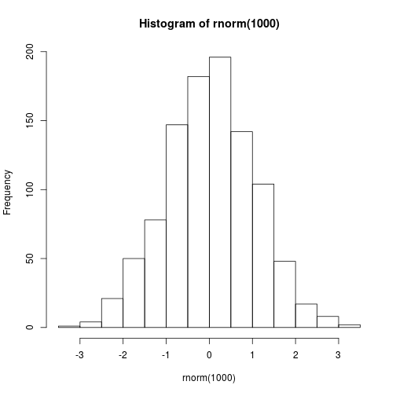
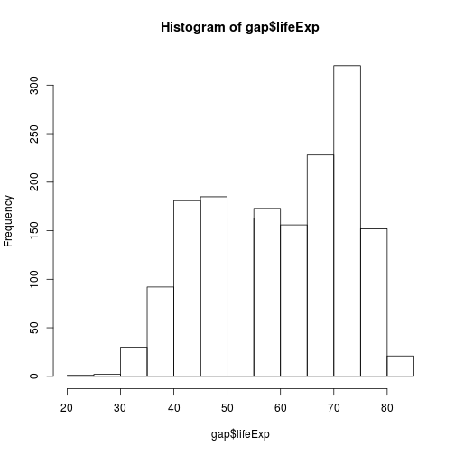
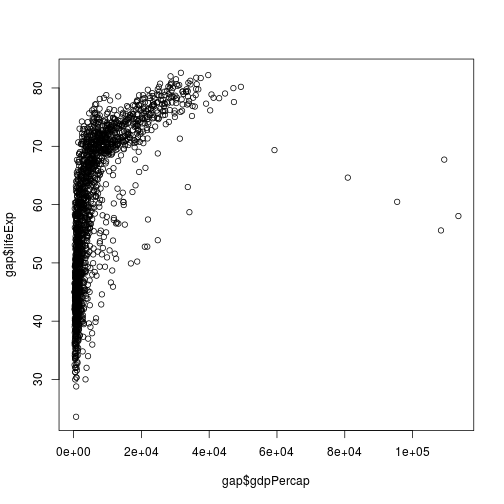
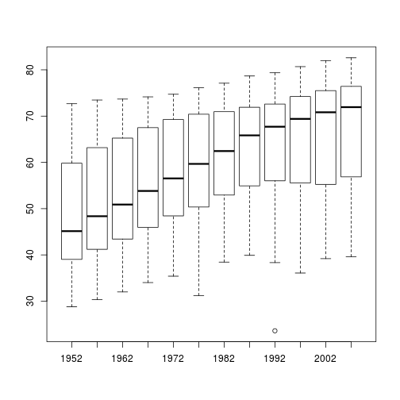
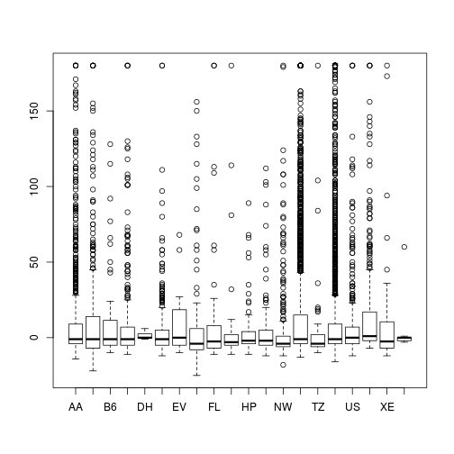
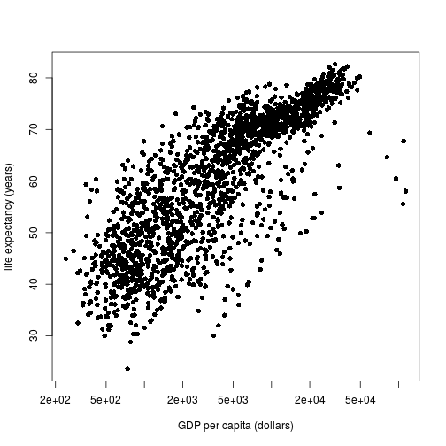

% R bootcamp, Module 1: Basics
% August 2018, UC Berkeley
% Chris Paciorek


# R as a calculator


```r
2 + 2 # add numbers
```

```
## [1] 4
```

```r
2 * pi # multiply by a constant
```

```
## [1] 6.283185
```

```r
7 + runif(1) # add a random number
```

```
## [1] 7.634133
```

```r
3^4 # powers
```

```
## [1] 81
```

```r
sqrt(4^4) # functions
```

```
## [1] 16
```

```r
log(10)
```

```
## [1] 2.302585
```

```r
log(100, base = 10)
```

```
## [1] 2
```

```r
23 %/% 2 
```

```
## [1] 11
```

```r
23 %% 2
```

```
## [1] 1
```

```r
# scientific notation
5000000000 * 1000
```

```
## [1] 5e+12
```

```r
5e9 * 1e3
```

```
## [1] 5e+12
```

Think of a mathematical operation you need - can you guess how to do it in R?

Side note to presenter: turn off R Notebook inline view via RStudio -> Preferences -> R Markdown -> Show output inline ...

# Assigning values to R objects

A key action in R is to store values in the form of R objects, and to examine the value of R objects.


```r
val <- 3
val
```

```
## [1] 3
```

```r
print(val)
```

```
## [1] 3
```

```r
Val <- 7 # case-sensitive!
print(c(val, Val))
```

```
## [1] 3 7
```

We can work with (and store) sequences and repetitions

```r
mySeq <- 1:6
mySeq
```

```
## [1] 1 2 3 4 5 6
```

```r
myOtherSeq <- seq(1.1, 11.1, by = 2)
myOtherSeq
```

```
## [1]  1.1  3.1  5.1  7.1  9.1 11.1
```

```r
length(myOtherSeq)
```

```
## [1] 6
```

```r
fours <- rep(4, 6)
fours
```

```
## [1] 4 4 4 4 4 4
```

```r
## This is a comment: here is an example of non-numeric data
depts <- c('espm', 'pmb', 'stats')
depts
```

```
## [1] "espm"  "pmb"   "stats"
```

If we don't assign the output of a command to an object, we haven't saved it for later use.

R gives us a lot of flexibility (within certain rules) for assigning to (parts of) objects from (parts of) other objects.

# How to be [lazy](http://dilbert.com/strips/comic/2005-05-29/)

If you're starting to type something you've typed before, or the long name of an R object or function, STOP!  You likely don't need to type all of that.

- Tab completion
- Command history 
    * up/down arrows
    * Ctrl-{up arrow} or Command-{up arrow}
- RStudio: select a line or block for execution
- Put your code in a file and use `source()`. For example: `source('myRcodeFile.R')`

**Question**: Are there other tricks that anyone knows of?

# Vectors in R

The most basic form of an R object is a vector. In fact, individual (scalar) values are vectors of length one. 

We can concatenate values into a vector with `c()`.


```r
## numeric vector
nums <- c(1.1, 3, -5.7)
devs <- rnorm(5)
devs
```

```
## [1] -1.3925546  1.2315562  0.5783870  0.1387761  1.0977254
```

```r
## integer vector
ints <- c(1L, 5L, -3L) # force storage as integer not decimal number
## 'L' is for 'long integer' (historical)

idevs <- sample(ints, 100, replace = TRUE)

## character vector
chars <- c('hi', 'hallo', "mother's", 'father\'s', 
   "She said, 'hi'", "He said, \"hi\"" )
chars
```

```
## [1] "hi"              "hallo"           "mother's"        "father's"       
## [5] "She said, 'hi'"  "He said, \"hi\""
```

```r
cat(chars, sep = "\n")
```

```
## hi
## hallo
## mother's
## father's
## She said, 'hi'
## He said, "hi"
```

```r
## logical vector
bools <- c(TRUE, FALSE, TRUE)
bools
```

```
## [1]  TRUE FALSE  TRUE
```

# Working with indices and subsets


```r
vals <- seq(2, 12, by = 2)
vals
```

```
## [1]  2  4  6  8 10 12
```

```r
vals[3]
```

```
## [1] 6
```

```r
vals[3:5]
```

```
## [1]  6  8 10
```

```r
vals[c(1, 3, 6)]
```

```
## [1]  2  6 12
```

```r
vals[-c(1, 3, 6)]
```

```
## [1]  4  8 10
```

```r
vals[c(rep(TRUE, 3), rep(FALSE, 2), TRUE)]
```

```
## [1]  2  4  6 12
```

```r
#######################################################################
## IMPORTANT: read in the airline dataset from disk;
## first make sure your working directory is the 'modules' directory
getwd()
```

```
## [1] "/accounts/gen/vis/paciorek/staff/workshops/r-bootcamp-2018/modules"
```

```r
## if the result is not the 'modules' subdirectory of the bootcamp
## directory, set the working directly along the lines of this:
##
## setwd('/Users/paciorek/Desktop/r-bootcamp-2018/modules')
##
## replace '/Users/paciorek/Desktop' with whatever directory you put the bootcamp
## materials in; e.g. on Windows it might be something like
## 'C:\\Users\\sarah\\r-bootcamp-2018\\modules'
##
## If you've done that correctly, then the next command reads
## in the dataset from the 'data' directory. In the next
## command R finds that directory relative to the current
## working directory.
air <- read.csv(file.path('..', 'data', 'airline.csv'),
    stringsAsFactors = FALSE)
#######################################################################

## create a simple vector from the airline dataset
delay <- air$DepDelay
delay[1:10]
```

```
##  [1] -5 -7 -3 NA -5 -1 75 -2 -9 83
```
We can substitute values into vectors

```r
vals[4] <- -35
vals[1:2] <- 0

vals <- rnorm(100)
## How does R process these next subset operations?
vals[vals < 0] <- 0
vals[1:8]
```

```
## [1] 0.4575196 0.7652858 0.3917274 0.0000000 0.0000000 0.0000000 0.7855149
## [8] 0.0000000
```

```r
crazymakers <- delay[delay > 300]
crazymakers[1:10]
```

```
##  [1] NA NA NA NA NA NA NA NA NA NA
```

```r
crazymakers <- crazymakers[ !is.na(crazymakers) ]
crazymakers[1:10]
```

```
##  [1] 303 315 323 369 488 304 397 308 302 301
```

# Vectorized calculations and comparisons

At the core of R is the idea of doing calculations on entire vectors.


```r
vec1 <- sample(1:5, 10, replace = TRUE)
vec2 <- sample(1:5, 10, replace = TRUE)
vec1
```

```
##  [1] 5 2 3 5 3 4 5 4 3 2
```

```r
vec2
```

```
##  [1] 1 5 4 4 5 2 5 1 4 5
```

```r
vec1 + vec2
```

```
##  [1]  6  7  7  9  8  6 10  5  7  7
```

```r
vec1^vec2
```

```
##  [1]    5   32   81  625  243   16 3125    4   81   32
```

```r
vec1 >= vec2
```

```
##  [1]  TRUE FALSE FALSE  TRUE FALSE  TRUE  TRUE  TRUE FALSE FALSE
```

```r
vec1 <= 3
```

```
##  [1] FALSE  TRUE  TRUE FALSE  TRUE FALSE FALSE FALSE  TRUE  TRUE
```

```r
## using 'or'
vec1 <= 0 | vec1 >= 3
```

```
##  [1]  TRUE FALSE  TRUE  TRUE  TRUE  TRUE  TRUE  TRUE  TRUE FALSE
```

```r
## using 'and'
vec1 <= 0 & vec1 >= vec2
```

```
##  [1] FALSE FALSE FALSE FALSE FALSE FALSE FALSE FALSE FALSE FALSE
```

```r
vec1 == vec2
```

```
##  [1] FALSE FALSE FALSE FALSE FALSE FALSE  TRUE FALSE FALSE FALSE
```

```r
vec1 != vec2
```

```
##  [1]  TRUE  TRUE  TRUE  TRUE  TRUE  TRUE FALSE  TRUE  TRUE  TRUE
```

```r
## careful: 
vec1 = vec2
identical(vec1, vec2)
```

```
## [1] TRUE
```

```r
delayChange <- air$DepDelay - air$ArrDelay ## make up time in flight?
tmp <- delayChange[1:100]
tmp >= 15 
```

```
##   [1] FALSE FALSE FALSE    NA FALSE FALSE FALSE  TRUE FALSE  TRUE FALSE
##  [12]  TRUE  TRUE  TRUE FALSE FALSE FALSE FALSE FALSE FALSE FALSE FALSE
##  [23] FALSE FALSE FALSE FALSE FALSE FALSE FALSE FALSE FALSE FALSE FALSE
##  [34] FALSE FALSE FALSE FALSE FALSE FALSE FALSE FALSE FALSE FALSE FALSE
##  [45] FALSE FALSE FALSE FALSE FALSE FALSE FALSE FALSE FALSE FALSE  TRUE
##  [56] FALSE FALSE FALSE FALSE FALSE FALSE FALSE FALSE FALSE FALSE FALSE
##  [67] FALSE    NA FALSE FALSE  TRUE FALSE FALSE FALSE FALSE FALSE FALSE
##  [78] FALSE FALSE FALSE FALSE FALSE FALSE FALSE FALSE FALSE FALSE FALSE
##  [89] FALSE FALSE FALSE FALSE FALSE FALSE FALSE FALSE FALSE FALSE FALSE
## [100] FALSE
```

An important related concept is that of recycling

```r
vec3 <- sample(1:5, 5, replace = TRUE)
vec4 <- sample(1:5, 3, replace = TRUE)
vec1
```

```
##  [1] 1 5 4 4 5 2 5 1 4 5
```

```r
vec3
```

```
## [1] 4 4 4 5 4
```

```r
vec4 
```

```
## [1] 5 5 1
```

```r
vec1 + vec3
```

```
##  [1] 5 9 8 9 9 6 9 5 9 9
```

```r
vec1 + vec4
```

```
## Warning in vec1 + vec4: longer object length is not a multiple of shorter
## object length
```

```
##  [1]  6 10  5  9 10  3 10  6  5 10
```

**Question**: Tell me what's going on. What choices were made by the R developers?

# R is a functional language

* Operations are carried out with functions. Functions take objects as inputs and return objects as outputs. 
* An analysis can be considered a pipeline of function calls, with output from a function used later in a subsequent operation as input to another function.
* Functions themselves are objects: 

```r
median
```

```
## function (x, na.rm = FALSE, ...) 
## UseMethod("median")
## <bytecode: 0x7696188>
## <environment: namespace:stats>
```

```r
class(median)
```

```
## [1] "function"
```

```r
median(delay)
```

```
## [1] NA
```

Functions generally take arguments, some of which are often optional:

```r
median(delay, na.rm = TRUE)
```

```
## [1] -1
```

* We can embed function calls: 

```r
hist(rnorm(1000))
```



# Getting help about a function

To get information about a function you know exists, use `help` or `?`, e.g., `?lm`. For information on a general topic, use `apropos` or `??`


```r
help(lm)
?lm

?log
```

# Basic kinds of R objects

Vectors are not the only kinds of R objects.

### Vectors 

Vectors of various types (numeric (i.e., decimal/floating point/double), integer, boolean, character), all items must be of the same type

### Matrices

Matrices of various types, all items must be of the same type


```r
mat <- matrix(rnorm(9), nrow = 3)
t(mat) %*% mat
```

```
##           [,1]       [,2]       [,3]
## [1,]  7.217654 -1.4517625 -1.1884433
## [2,] -1.451763  1.1983974  0.3870706
## [3,] -1.188443  0.3870706  0.5727944
```

```r
dim(mat)
```

```
## [1] 3 3
```

### Data frames

Collections of columns of potentially different types


```r
head(air)
```

```
##   Year Month DayofMonth DayOfWeek DepTime CRSDepTime ArrTime CRSArrTime
## 1 2005     1          1         6    1211       1216    1451       1502
## 2 2005     1          2         7    1209       1216    1447       1502
## 3 2005     1          3         1    1213       1216    1454       1502
## 4 2005     1          4         2      NA       1216      NA       1502
## 5 2005     1          5         3    1211       1216    1504       1502
## 6 2005     1          6         4    1214       1215    1506       1505
##   UniqueCarrier FlightNum TailNum ActualElapsedTime CRSElapsedTime AirTime
## 1            UA       548  N341UA               100            106      81
## 2            UA       548  N398UA                98            106      79
## 3            UA       548  N303UA               101            106      83
## 4            UA       548  000000                NA            106      NA
## 5            UA       548  N917UA               113            106      85
## 6            UA       548  N924UA               112            110      95
##   ArrDelay DepDelay Origin Dest Distance TaxiIn TaxiOut Cancelled
## 1      -11       -5    SFO  SLC      599      2      17         0
## 2      -15       -7    SFO  SLC      599      2      17         0
## 3       -8       -3    SFO  SLC      599      3      15         0
## 4       NA       NA    SFO  SLC      599      0       0         1
## 5        2       -5    SFO  SLC      599      6      22         0
## 6        1       -1    SFO  SLC      599      6      11         0
##   CancellationCode Diverted CarrierDelay WeatherDelay NASDelay
## 1                         0            0            0        0
## 2                         0            0            0        0
## 3                         0            0            0        0
## 4                A        0            0            0        0
## 5                         0            0            0        0
## 6                         0            0            0        0
##   SecurityDelay LateAircraftDelay
## 1             0                 0
## 2             0                 0
## 3             0                 0
## 4             0                 0
## 5             0                 0
## 6             0                 0
```

```r
dim(air)
```

```
## [1] 539895     29
```

```r
nrow(air)
```

```
## [1] 539895
```

```r
names(air)
```

```
##  [1] "Year"              "Month"             "DayofMonth"       
##  [4] "DayOfWeek"         "DepTime"           "CRSDepTime"       
##  [7] "ArrTime"           "CRSArrTime"        "UniqueCarrier"    
## [10] "FlightNum"         "TailNum"           "ActualElapsedTime"
## [13] "CRSElapsedTime"    "AirTime"           "ArrDelay"         
## [16] "DepDelay"          "Origin"            "Dest"             
## [19] "Distance"          "TaxiIn"            "TaxiOut"          
## [22] "Cancelled"         "CancellationCode"  "Diverted"         
## [25] "CarrierDelay"      "WeatherDelay"      "NASDelay"         
## [28] "SecurityDelay"     "LateAircraftDelay"
```

```r
class(air)
```

```
## [1] "data.frame"
```

```r
is.matrix(air)
```

```
## [1] FALSE
```

```r
class(air$DepDelay)
```

```
## [1] "integer"
```

```r
class(air$UniqueCarrier)
```

```
## [1] "character"
```

```r
class(air$Diverted)
```

```
## [1] "integer"
```

### Lists

Collections of disparate or complicated objects


```r
myList <- list(stuff = 3, mat = matrix(1:4, nrow = 2), 
   moreStuff = c("china", "japan"), list(5, "bear"))
myList
```

```
## $stuff
## [1] 3
## 
## $mat
##      [,1] [,2]
## [1,]    1    3
## [2,]    2    4
## 
## $moreStuff
## [1] "china" "japan"
## 
## [[4]]
## [[4]][[1]]
## [1] 5
## 
## [[4]][[2]]
## [1] "bear"
```

```r
myList[[1]] # result is not (usually) a list (unless you have nested lists)
```

```
## [1] 3
```

```r
identical(myList[[1]], myList$stuff)
```

```
## [1] TRUE
```

```r
myList$moreStuff[2]
```

```
## [1] "japan"
```

```r
myList[[4]][[2]]
```

```
## [1] "bear"
```

```r
myList[1:3] # subset of a list is a list
```

```
## $stuff
## [1] 3
## 
## $mat
##      [,1] [,2]
## [1,]    1    3
## [2,]    2    4
## 
## $moreStuff
## [1] "china" "japan"
```

```r
myList$newOne <- 'more weird stuff'
names(myList)
```

```
## [1] "stuff"     "mat"       "moreStuff" ""          "newOne"
```

Lists can be used as vectors of complicated objects. E.g., suppose you have a linear regression for each value of a stratifying variable. You could have a list of regression fits. Each regression fit will itself be a list, so you'll have a list of lists.

# Other classes of objects      

R has several approaches to object-oriented programming.  These are widely used, albeit a bit klunky. 

The most basic is 'S3' objects. These objects are generally built upon lists.


```r
mod <- lm(air$DepDelay ~ air$Distance)  # illustration ONLY - poorly-specified model!
class(mod)
```

```
## [1] "lm"
```

```r
is.list(mod)
```

```
## [1] TRUE
```

```r
names(mod)
```

```
##  [1] "coefficients"  "residuals"     "effects"       "rank"         
##  [5] "fitted.values" "assign"        "qr"            "df.residual"  
##  [9] "na.action"     "xlevels"       "call"          "terms"        
## [13] "model"
```

```r
mod$coefficients
```

```
##   (Intercept)  air$Distance 
## 11.8174759897 -0.0006203753
```

```r
mod[['coefficients']]
```

```
##   (Intercept)  air$Distance 
## 11.8174759897 -0.0006203753
```

```r
mod[[1]]
```

```
##   (Intercept)  air$Distance 
## 11.8174759897 -0.0006203753
```

The magic of OOP here is that methods (i.e., functions) can be tailored to work specifically with specific kinds of objects.


```r
summary(air$DepDelay)
```

```
##    Min. 1st Qu.  Median    Mean 3rd Qu.    Max.    NA's 
## -169.00   -5.00   -1.00   11.16   10.00 1659.00    9321
```

```r
summary(mod)
```

```
## 
## Call:
## lm(formula = air$DepDelay ~ air$Distance)
## 
## Residuals:
##     Min      1Q  Median      3Q     Max 
## -179.33  -15.65  -12.22   -0.83 1648.17 
## 
## Coefficients:
##                Estimate Std. Error t value Pr(>|t|)    
## (Intercept)   1.182e+01  7.312e-02  161.63   <2e-16 ***
## air$Distance -6.204e-04  5.281e-05  -11.75   <2e-16 ***
## ---
## Signif. codes:  0 '***' 0.001 '**' 0.01 '*' 0.05 '.' 0.1 ' ' 1
## 
## Residual standard error: 34.37 on 530572 degrees of freedom
##   (9321 observations deleted due to missingness)
## Multiple R-squared:  0.0002601,	Adjusted R-squared:  0.0002582 
## F-statistic:   138 on 1 and 530572 DF,  p-value: < 2.2e-16
```

**Question**: What do you think R is doing behind the scenes?

Consider `summary.lm`.

# Converting between different types of objects

You can use the `as()` family of functions.


```r
ints <- 1:10
as.character(ints)
```

```
##  [1] "1"  "2"  "3"  "4"  "5"  "6"  "7"  "8"  "9"  "10"
```

```r
as.numeric(c('3.7', '4.8'))
```

```
## [1] 3.7 4.8
```

Be careful: R tries to be helpful and convert between types/classes when it thinks it's a good idea. Sometimes it is overly optimistic. 


```r
indices <- c(1.7, 2.3)
ints[indices]
```

```
## [1] 1 2
```

```r
ints[0.999999999]
```

```
## integer(0)
```


# Managing your objects

R has a number of functions for getting metadata about your objects. Some of this is built in to RStudio.


```r
vec1 <- 1:4
vec2 <- c(1, 2, 3, 4)

length(vec1)
```

```
## [1] 4
```

```r
str(vec1)
```

```
##  int [1:4] 1 2 3 4
```

```r
class(vec1)
```

```
## [1] "integer"
```

```r
typeof(vec1)
```

```
## [1] "integer"
```

```r
class(vec2)
```

```
## [1] "numeric"
```

```r
typeof(vec2)
```

```
## [1] "double"
```

```r
is.vector(vec1)
```

```
## [1] TRUE
```

```r
is.list(vec1)
```

```
## [1] FALSE
```

```r
is.list(myList)
```

```
## [1] TRUE
```

```r
is.vector(myList)
```

```
## [1] TRUE
```

```r
is.data.frame(air)
```

```
## [1] TRUE
```

```r
is.list(air)
```

```
## [1] TRUE
```

**Question**: What have you learned? Does it make sense? 


# A bit on plotting

R has several different plotting systems:

- *base* graphics
- *lattice* graphics
- *ggplot2* (an add-on package)

We'll see a little bit of *base* graphics here and then *lattice* and *ggplot2* tomorrow in Module 8.


```r
hist(air$DepDelay)
```



```r
## make a random subset for quicker plotting:
set.seed(1)  # make the subset reproducible
randomRows <- sample(1:nrow(air), 10000, replace = FALSE)
subset <- air[randomRows, ]
## censor the outliers to limit plotting range
subset$DepDelay[subset$DepDelay > 60*3] <- 60*3
plot(subset$DepDelay ~ subset$Distance)
```



```r
boxplot(subset$DepDelay ~ subset$DayOfWeek)
```



```r
boxplot(subset$DepDelay ~ subset$UniqueCarrier)
```



# Graphics options

Check out `help(par)` for various [graphics settings](http://xkcd.com/833/); these are set via `par()` or within the specific graphics command (some can be set in either place), e.g.,

```r
par(pch = 2)
plot(subset$DepDelay ~ subset$Distance, xlab = 'distance (miles)', 
   ylab = 'delay (minutes)', log = 'x')
```



# Breakout

In general, your answers to any questions should involve writing code to manipulate objects. For example, if I ask you to find the maximum flight delay, do not scan through all the values and find it by eye. Use R to do the calculations and print results.

### Basics

1) Create a variable called 'x' that contains the mean flight delay.

2) Use functions in R to round 'x' to two decimal places and to two significant digits.

3) Create a vector of flight distances in units of kilometers rather than miles.

4) Create a boolean (TRUE/FALSE) vector indicating whether the departure delay is shorter than the arrival delay.

### Using the ideas

5) Summarize the difference between the departure and arrival delays. Do flights tend to make up some of the delay time in flight?

6) Plot a histogram of the flight departure delays with negative delays set to zero, censoring delay times at a maximum of 60 minutes. Explore the effect of changing the number of bins in the histogram using the 'breaks' argument.

7) Subset the data to flights going to Chicago (ORD) and Houston (IAH). Plot delay against scheduled departure time (CRSDepTime). Add a title to the plot. Now plot so that flights to Chicago are in one color and  those to Houston in another, using the 'col' argument. What are some problems with the plot?

8) Consider the following regression model.  Figure out how to extract the $R^2$ and residual standard error and store in new R variables. 


```r
y <- rnorm(10)
x <- rnorm(10)
mod <- lm(y ~ x)
summ <- summary(mod)
```

### Advanced

9) For flights to ORD and IAH, plot departure delay against time in days where day 1 is Jan 1 2005 and the last day is Dec 31 2008. As above, use different colors for the two different destinations.

10) Now modify the size of the points. Add a legend. Rotate the numbers on the y-axis so they are printed horizontally. Recall that `help(par)` will provide a lot of information.
