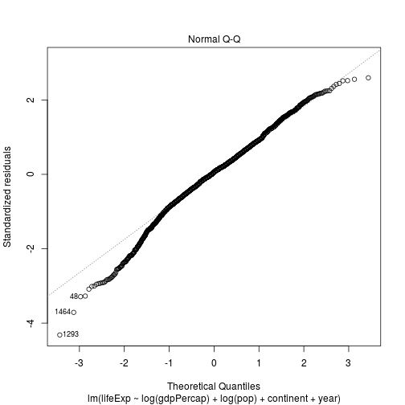
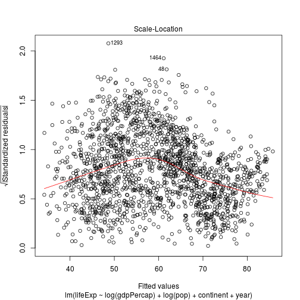
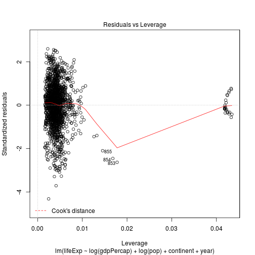
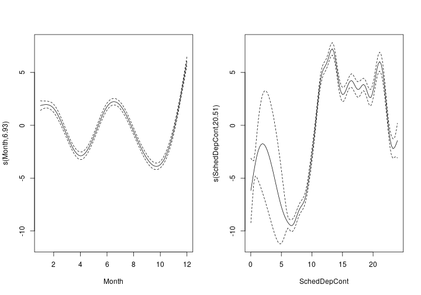
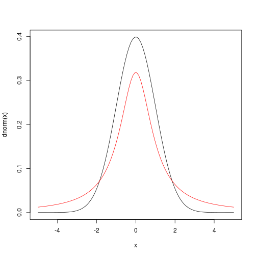
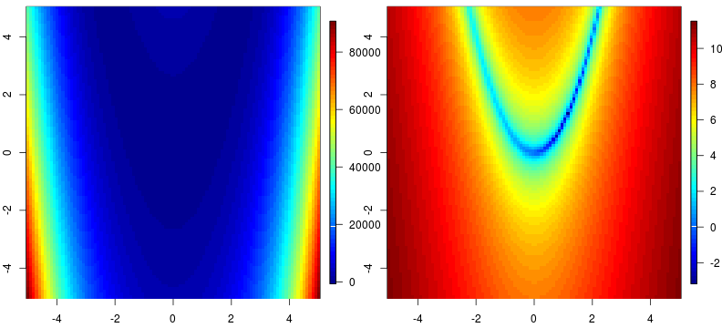

% R bootcamp, Module 7: Analysis
% August 2018, UC Berkeley
% Chris Paciorek


# Describing relationships

- Once we've carried out group-wise operations and perhaps reshaped it, we may also like to describe the relationships in the data. Often this involves fitting some style of regression model.  The goal can be pure prediction, description, or inferring a causal relationship between variables.

Of course to infer causality, one has to be quite careful and techniques that try to avoid the usual pitfall that correlation is not causation are way beyond what we can cover here.

We'll just see the basics of how to fit regressions here. 

# Inference/Regression

- Running regressions in R is generally straightforward.

- Most basic, catch-all regression function in R is *glm*

- *glm* fits a generalized linear model with your choice of family/link function (gaussian, logit, poisson, etc.)

- *lm* is just a standard linear regression (equivalent to glm with family = gaussian(link = "identity"))

- The basic glm call looks something like this:


```r
glm(formula = y~x1+x2+x3+..., family = familyname(link = "linkname"),
            data = )
```

- There are a bunch of families and links to use (help(family) for a full list), but some essentials are **binomial(link = "logit")**, **gaussian(link = "identity")**, and **poisson(link = "log")**

If you're using `lm`, the call looks the same but without the `family` argument. 

- Example: suppose we want to regress the life expectency on the GDP per capita and the population, as well as the continent and year.  The lm/glm call would be something like this:


```r
gapminder <- read.csv(file.path("..", "data",
          "gapminder-FiveYearData.csv"), stringsAsFactors = TRUE)

reg <- lm(formula = lifeExp ~ gdpPercap + pop + continent + year, 
                data = gapminder)
```

# Regression output

- When we store this regression in an object, we get access to several items of interest


```r
# View components contained in the regression output
names(reg)
```

```
##  [1] "coefficients"  "residuals"     "effects"       "rank"         
##  [5] "fitted.values" "assign"        "qr"            "df.residual"  
##  [9] "contrasts"     "xlevels"       "call"          "terms"        
## [13] "model"
```

```r
# Examine regression coefficients
reg$coefficients
```

```
##       (Intercept)         gdpPercap               pop continentAmericas 
##     -5.184555e+02      2.984892e-04      1.790640e-09      1.429204e+01 
##     continentAsia   continentEurope  continentOceania              year 
##      9.375486e+00      1.936120e+01      2.055921e+01      2.862583e-01
```

```r
# Examine regression degrees of freedom
reg$df.residual
```

```
## [1] 1696
```

```r
# Examine regression fit (AIC)
reg$aic
```

```
## NULL
```

```r
# See the standard (diagnostic) plots for a regression
plot(reg)
```



- R has a helpful summary method for regression objects

```r
summary(reg)
```

```
## 
## Call:
## lm(formula = lifeExp ~ gdpPercap + pop + continent + year, data = gapminder)
## 
## Residuals:
##      Min       1Q   Median       3Q      Max 
## -28.4051  -4.0550   0.2317   4.5073  20.0217 
## 
## Coefficients:
##                     Estimate Std. Error t value Pr(>|t|)    
## (Intercept)       -5.185e+02  1.989e+01 -26.062   <2e-16 ***
## gdpPercap          2.985e-04  2.002e-05  14.908   <2e-16 ***
## pop                1.791e-09  1.634e-09   1.096    0.273    
## continentAmericas  1.429e+01  4.946e-01  28.898   <2e-16 ***
## continentAsia      9.375e+00  4.719e-01  19.869   <2e-16 ***
## continentEurope    1.936e+01  5.182e-01  37.361   <2e-16 ***
## continentOceania   2.056e+01  1.469e+00  13.995   <2e-16 ***
## year               2.863e-01  1.006e-02  28.469   <2e-16 ***
## ---
## Signif. codes:  0 '***' 0.001 '**' 0.01 '*' 0.05 '.' 0.1 ' ' 1
## 
## Residual standard error: 6.883 on 1696 degrees of freedom
## Multiple R-squared:  0.7172,	Adjusted R-squared:  0.716 
## F-statistic: 614.5 on 7 and 1696 DF,  p-value: < 2.2e-16
```

- Can also extract useful things from the summary object


```r
# Store summary method results
summ_reg <- summary(reg)
# View summary method results objects
objects(summ_reg)
```

```
##  [1] "adj.r.squared" "aliased"       "call"          "coefficients" 
##  [5] "cov.unscaled"  "df"            "fstatistic"    "residuals"    
##  [9] "r.squared"     "sigma"         "terms"
```

```r
# View table of coefficients
summ_reg$coefficients
```

```
##                        Estimate   Std. Error    t value      Pr(>|t|)
## (Intercept)       -5.184555e+02 1.989299e+01 -26.062215 3.248472e-126
## gdpPercap          2.984892e-04 2.002178e-05  14.908225  2.522143e-47
## pop                1.790640e-09 1.634107e-09   1.095791  2.733256e-01
## continentAmericas  1.429204e+01 4.945645e-01  28.898241 1.183161e-149
## continentAsia      9.375486e+00 4.718629e-01  19.869087  3.798275e-79
## continentEurope    1.936120e+01 5.182170e-01  37.361177 2.025551e-223
## continentOceania   2.055921e+01 1.469070e+00  13.994707  3.390781e-42
## year               2.862583e-01 1.005523e-02  28.468586 4.800797e-146
```

- Note that, in our results, R has broken up our variables into their different factor levels (as it will do whenever your regressors have factor levels)

- If your data aren't factorized, you can tell lm/glm to factorize a variable (i.e. create dummy variables on the fly) by writing


```r
glm(formula = y~x1+x2+factor(x3), family = family(link = "link"),
            data = )
```

# Setting up regression interactions

- There are also some useful shortcuts for regressing on interaction terms:

`x1:x2` interacts all terms in x1 with all terms in x2

```r
summary(glm(formula = lifeExp ~ gdpPercap + pop +
                    continent:factor(year), 
                family = gaussian, data = gapminder))
```

```
## 
## Call:
## glm(formula = lifeExp ~ gdpPercap + pop + continent:factor(year), 
##     family = gaussian, data = gapminder)
## 
## Deviance Residuals: 
##      Min        1Q    Median        3Q       Max  
## -29.5073   -3.4687    0.1739    3.5145   21.1851  
## 
## Coefficients: (1 not defined because of singularities)
##                                      Estimate Std. Error t value Pr(>|t|)
## (Intercept)                         7.070e+01  4.745e+00  14.901  < 2e-16
## gdpPercap                           3.356e-04  1.997e-05  16.805  < 2e-16
## pop                                 8.980e-10  1.586e-09   0.566 0.571275
## continentAfrica:factor(year)1952   -3.199e+01  4.831e+00  -6.623 4.77e-11
## continentAmericas:factor(year)1952 -1.881e+01  4.919e+00  -3.823 0.000137
## continentAsia:factor(year)1952     -2.617e+01  4.872e+00  -5.371 8.94e-08
## continentEurope:factor(year)1952   -8.208e+00  4.885e+00  -1.680 0.093146
## continentOceania:factor(year)1952  -4.910e+00  6.668e+00  -0.736 0.461687
## continentAfrica:factor(year)1957   -2.991e+01  4.830e+00  -6.191 7.52e-10
## continentAmericas:factor(year)1957 -1.631e+01  4.918e+00  -3.316 0.000933
## continentAsia:factor(year)1957     -2.337e+01  4.871e+00  -4.797 1.75e-06
## continentEurope:factor(year)1957   -6.351e+00  4.883e+00  -1.301 0.193592
## continentOceania:factor(year)1957  -4.307e+00  6.667e+00  -0.646 0.518393
## continentAfrica:factor(year)1962   -2.793e+01  4.830e+00  -5.782 8.83e-09
## continentAmericas:factor(year)1962 -1.397e+01  4.917e+00  -2.840 0.004564
## continentAsia:factor(year)1962     -2.111e+01  4.871e+00  -4.333 1.56e-05
## continentEurope:factor(year)1962   -4.986e+00  4.880e+00  -1.022 0.307127
## continentOceania:factor(year)1962  -3.886e+00  6.666e+00  -0.583 0.560019
## continentAfrica:factor(year)1967   -2.606e+01  4.829e+00  -5.397 7.75e-08
## continentAmericas:factor(year)1967 -1.221e+01  4.915e+00  -2.484 0.013074
## continentAsia:factor(year)1967     -1.810e+01  4.871e+00  -3.715 0.000210
## continentEurope:factor(year)1967   -4.385e+00  4.877e+00  -0.899 0.368777
## continentOceania:factor(year)1967  -4.265e+00  6.664e+00  -0.640 0.522266
## continentAfrica:factor(year)1972   -2.404e+01  4.828e+00  -4.980 7.03e-07
## continentAmericas:factor(year)1972 -1.051e+01  4.914e+00  -2.138 0.032658
## continentAsia:factor(year)1972     -1.619e+01  4.867e+00  -3.327 0.000899
## continentEurope:factor(year)1972   -4.132e+00  4.874e+00  -0.848 0.396689
## continentOceania:factor(year)1972  -4.311e+00  6.662e+00  -0.647 0.517700
## continentAfrica:factor(year)1977   -2.200e+01  4.828e+00  -4.557 5.58e-06
## continentAmericas:factor(year)1977 -8.800e+00  4.912e+00  -1.791 0.073401
## continentAsia:factor(year)1977     -1.377e+01  4.868e+00  -2.829 0.004722
## continentEurope:factor(year)1977   -3.575e+00  4.871e+00  -0.734 0.463098
## continentOceania:factor(year)1977  -3.657e+00  6.662e+00  -0.549 0.583093
## continentAfrica:factor(year)1982   -1.995e+01  4.828e+00  -4.133 3.77e-05
## continentAmericas:factor(year)1982 -7.017e+00  4.912e+00  -1.428 0.153339
## continentAsia:factor(year)1982     -1.065e+01  4.869e+00  -2.188 0.028825
## continentEurope:factor(year)1982   -3.155e+00  4.870e+00  -0.648 0.517193
## continentOceania:factor(year)1982  -2.649e+00  6.661e+00  -0.398 0.690885
## continentAfrica:factor(year)1987   -1.813e+01  4.828e+00  -3.756 0.000179
## continentAmericas:factor(year)1987 -5.253e+00  4.911e+00  -1.070 0.284987
## continentAsia:factor(year)1987     -8.484e+00  4.869e+00  -1.743 0.081591
## continentEurope:factor(year)1987   -2.855e+00  4.868e+00  -0.587 0.557619
## continentOceania:factor(year)1987  -2.255e+00  6.660e+00  -0.339 0.734934
## continentAfrica:factor(year)1992   -1.785e+01  4.828e+00  -3.697 0.000225
## continentAmericas:factor(year)1992 -3.862e+00  4.911e+00  -0.786 0.431776
## continentAsia:factor(year)1992     -7.151e+00  4.867e+00  -1.469 0.141935
## continentEurope:factor(year)1992   -2.006e+00  4.868e+00  -0.412 0.680292
## continentOceania:factor(year)1992  -7.804e-01  6.659e+00  -0.117 0.906723
## continentAfrica:factor(year)1997   -1.792e+01  4.828e+00  -3.711 0.000213
## continentAmericas:factor(year)1997 -2.565e+00  4.910e+00  -0.522 0.601411
## continentAsia:factor(year)1997     -6.076e+00  4.865e+00  -1.249 0.211930
## continentEurope:factor(year)1997   -1.618e+00  4.866e+00  -0.332 0.739563
## continentOceania:factor(year)1997  -5.865e-01  6.658e+00  -0.088 0.929810
## continentAfrica:factor(year)2002   -1.827e+01  4.827e+00  -3.784 0.000160
## continentAmericas:factor(year)2002 -1.429e+00  4.909e+00  -0.291 0.770984
## continentAsia:factor(year)2002     -4.982e+00  4.865e+00  -1.024 0.305936
## continentEurope:factor(year)2002   -1.307e+00  4.864e+00  -0.269 0.788171
## continentOceania:factor(year)2002  -1.530e-02  6.657e+00  -0.002 0.998167
## continentAfrica:factor(year)2007   -1.695e+01  4.826e+00  -3.512 0.000457
## continentAmericas:factor(year)2007 -8.205e-01  4.906e+00  -0.167 0.867195
## continentAsia:factor(year)2007     -4.265e+00  4.862e+00  -0.877 0.380494
## continentEurope:factor(year)2007   -1.481e+00  4.862e+00  -0.305 0.760680
## continentOceania:factor(year)2007          NA         NA      NA       NA
##                                       
## (Intercept)                        ***
## gdpPercap                          ***
## pop                                   
## continentAfrica:factor(year)1952   ***
## continentAmericas:factor(year)1952 ***
## continentAsia:factor(year)1952     ***
## continentEurope:factor(year)1952   .  
## continentOceania:factor(year)1952     
## continentAfrica:factor(year)1957   ***
## continentAmericas:factor(year)1957 ***
## continentAsia:factor(year)1957     ***
## continentEurope:factor(year)1957      
## continentOceania:factor(year)1957     
## continentAfrica:factor(year)1962   ***
## continentAmericas:factor(year)1962 ** 
## continentAsia:factor(year)1962     ***
## continentEurope:factor(year)1962      
## continentOceania:factor(year)1962     
## continentAfrica:factor(year)1967   ***
## continentAmericas:factor(year)1967 *  
## continentAsia:factor(year)1967     ***
## continentEurope:factor(year)1967      
## continentOceania:factor(year)1967     
## continentAfrica:factor(year)1972   ***
## continentAmericas:factor(year)1972 *  
## continentAsia:factor(year)1972     ***
## continentEurope:factor(year)1972      
## continentOceania:factor(year)1972     
## continentAfrica:factor(year)1977   ***
## continentAmericas:factor(year)1977 .  
## continentAsia:factor(year)1977     ** 
## continentEurope:factor(year)1977      
## continentOceania:factor(year)1977     
## continentAfrica:factor(year)1982   ***
## continentAmericas:factor(year)1982    
## continentAsia:factor(year)1982     *  
## continentEurope:factor(year)1982      
## continentOceania:factor(year)1982     
## continentAfrica:factor(year)1987   ***
## continentAmericas:factor(year)1987    
## continentAsia:factor(year)1987     .  
## continentEurope:factor(year)1987      
## continentOceania:factor(year)1987     
## continentAfrica:factor(year)1992   ***
## continentAmericas:factor(year)1992    
## continentAsia:factor(year)1992        
## continentEurope:factor(year)1992      
## continentOceania:factor(year)1992     
## continentAfrica:factor(year)1997   ***
## continentAmericas:factor(year)1997    
## continentAsia:factor(year)1997        
## continentEurope:factor(year)1997      
## continentOceania:factor(year)1997     
## continentAfrica:factor(year)2002   ***
## continentAmericas:factor(year)2002    
## continentAsia:factor(year)2002        
## continentEurope:factor(year)2002      
## continentOceania:factor(year)2002     
## continentAfrica:factor(year)2007   ***
## continentAmericas:factor(year)2007    
## continentAsia:factor(year)2007        
## continentEurope:factor(year)2007      
## continentOceania:factor(year)2007     
## ---
## Signif. codes:  0 '***' 0.001 '**' 0.01 '*' 0.05 '.' 0.1 ' ' 1
## 
## (Dispersion parameter for gaussian family taken to be 44.3151)
## 
##     Null deviance: 284148  on 1703  degrees of freedom
## Residual deviance:  72765  on 1642  degrees of freedom
## AIC: 11359
## 
## Number of Fisher Scoring iterations: 2
```

`x1*x2` produces the cross of x1 and x2, or x1+x2+x1:x2

```r
summary(glm(formula = lifeExp ~ gdpPercap + pop + continent*factor(year), 
                family = gaussian, data = gapminder))
```

```
## 
## Call:
## glm(formula = lifeExp ~ gdpPercap + pop + continent * factor(year), 
##     family = gaussian, data = gapminder)
## 
## Deviance Residuals: 
##      Min        1Q    Median        3Q       Max  
## -29.5073   -3.4687    0.1739    3.5145   21.1851  
## 
## Coefficients:
##                                      Estimate Std. Error t value Pr(>|t|)
## (Intercept)                         3.871e+01  9.235e-01  41.916  < 2e-16
## gdpPercap                           3.356e-04  1.997e-05  16.805  < 2e-16
## pop                                 8.980e-10  1.586e-09   0.566 0.571275
## continentAmericas                   1.319e+01  1.621e+00   8.134 8.09e-16
## continentAsia                       5.822e+00  1.485e+00   3.920 9.22e-05
## continentEurope                     2.379e+01  1.529e+00  15.557  < 2e-16
## continentOceania                    2.708e+01  4.800e+00   5.642 1.98e-08
## factor(year)1957                    2.086e+00  1.306e+00   1.598 0.110304
## factor(year)1962                    4.067e+00  1.306e+00   3.115 0.001871
## factor(year)1967                    5.930e+00  1.306e+00   4.542 5.99e-06
## factor(year)1972                    7.948e+00  1.306e+00   6.087 1.43e-09
## factor(year)1977                    9.994e+00  1.306e+00   7.653 3.32e-14
## factor(year)1982                    1.204e+01  1.306e+00   9.221  < 2e-16
## factor(year)1987                    1.386e+01  1.306e+00  10.613  < 2e-16
## factor(year)1992                    1.414e+01  1.306e+00  10.830  < 2e-16
## factor(year)1997                    1.408e+01  1.306e+00  10.779  < 2e-16
## factor(year)2002                    1.373e+01  1.306e+00  10.511  < 2e-16
## factor(year)2007                    1.504e+01  1.306e+00  11.515  < 2e-16
## continentAmericas:factor(year)1957  4.129e-01  2.291e+00   0.180 0.857023
## continentAsia:factor(year)1957      7.150e-01  2.095e+00   0.341 0.732979
## continentEurope:factor(year)1957   -2.288e-01  2.159e+00  -0.106 0.915582
## continentOceania:factor(year)1957  -1.483e+00  6.784e+00  -0.219 0.826997
## continentAmericas:factor(year)1962  7.727e-01  2.291e+00   0.337 0.735962
## continentAsia:factor(year)1962      9.945e-01  2.095e+00   0.475 0.635119
## continentEurope:factor(year)1962   -8.452e-01  2.159e+00  -0.391 0.695499
## continentOceania:factor(year)1962  -3.043e+00  6.784e+00  -0.449 0.653798
## continentAmericas:factor(year)1967  6.632e-01  2.291e+00   0.289 0.772261
## continentAsia:factor(year)1967      2.145e+00  2.095e+00   1.024 0.306043
## continentEurope:factor(year)1967   -2.107e+00  2.160e+00  -0.976 0.329424
## continentOceania:factor(year)1967  -5.285e+00  6.784e+00  -0.779 0.436082
## continentAmericas:factor(year)1972  3.507e-01  2.291e+00   0.153 0.878376
## continentAsia:factor(year)1972      2.032e+00  2.096e+00   0.969 0.332439
## continentEurope:factor(year)1972   -3.873e+00  2.161e+00  -1.792 0.073375
## continentOceania:factor(year)1972  -7.349e+00  6.785e+00  -1.083 0.278856
## continentAmericas:factor(year)1977  1.084e-02  2.292e+00   0.005 0.996226
## continentAsia:factor(year)1977      2.404e+00  2.096e+00   1.147 0.251547
## continentEurope:factor(year)1977   -5.362e+00  2.163e+00  -2.478 0.013293
## continentOceania:factor(year)1977  -8.742e+00  6.785e+00  -1.288 0.197779
## continentAmericas:factor(year)1982 -2.520e-01  2.292e+00  -0.110 0.912450
## continentAsia:factor(year)1982      3.479e+00  2.096e+00   1.660 0.097163
## continentEurope:factor(year)1982   -6.988e+00  2.165e+00  -3.227 0.001276
## continentOceania:factor(year)1982  -9.780e+00  6.785e+00  -1.441 0.149674
## continentAmericas:factor(year)1987 -3.056e-01  2.292e+00  -0.133 0.893940
## continentAsia:factor(year)1987      3.829e+00  2.096e+00   1.827 0.067953
## continentEurope:factor(year)1987   -8.505e+00  2.169e+00  -3.922 9.14e-05
## continentOceania:factor(year)1987  -1.120e+01  6.786e+00  -1.651 0.098952
## continentAmericas:factor(year)1992  8.020e-01  2.292e+00   0.350 0.726462
## continentAsia:factor(year)1992      4.878e+00  2.097e+00   2.326 0.020134
## continentEurope:factor(year)1992   -7.940e+00  2.168e+00  -3.662 0.000258
## continentOceania:factor(year)1992  -1.001e+01  6.786e+00  -1.475 0.140318
## continentAmericas:factor(year)1997  2.164e+00  2.292e+00   0.944 0.345341
## continentAsia:factor(year)1997      6.019e+00  2.098e+00   2.869 0.004174
## continentEurope:factor(year)1997   -7.487e+00  2.172e+00  -3.446 0.000582
## continentOceania:factor(year)1997  -9.753e+00  6.788e+00  -1.437 0.150990
## continentAmericas:factor(year)2002  3.649e+00  2.293e+00   1.591 0.111701
## continentAsia:factor(year)2002      7.461e+00  2.099e+00   3.555 0.000388
## continentEurope:factor(year)2002   -6.827e+00  2.178e+00  -3.134 0.001753
## continentOceania:factor(year)2002  -8.833e+00  6.791e+00  -1.301 0.193515
## continentAmericas:factor(year)2007  2.942e+00  2.294e+00   1.283 0.199720
## continentAsia:factor(year)2007      6.864e+00  2.101e+00   3.267 0.001108
## continentEurope:factor(year)2007   -8.316e+00  2.187e+00  -3.803 0.000148
## continentOceania:factor(year)2007  -1.013e+01  6.793e+00  -1.492 0.135983
##                                       
## (Intercept)                        ***
## gdpPercap                          ***
## pop                                   
## continentAmericas                  ***
## continentAsia                      ***
## continentEurope                    ***
## continentOceania                   ***
## factor(year)1957                      
## factor(year)1962                   ** 
## factor(year)1967                   ***
## factor(year)1972                   ***
## factor(year)1977                   ***
## factor(year)1982                   ***
## factor(year)1987                   ***
## factor(year)1992                   ***
## factor(year)1997                   ***
## factor(year)2002                   ***
## factor(year)2007                   ***
## continentAmericas:factor(year)1957    
## continentAsia:factor(year)1957        
## continentEurope:factor(year)1957      
## continentOceania:factor(year)1957     
## continentAmericas:factor(year)1962    
## continentAsia:factor(year)1962        
## continentEurope:factor(year)1962      
## continentOceania:factor(year)1962     
## continentAmericas:factor(year)1967    
## continentAsia:factor(year)1967        
## continentEurope:factor(year)1967      
## continentOceania:factor(year)1967     
## continentAmericas:factor(year)1972    
## continentAsia:factor(year)1972        
## continentEurope:factor(year)1972   .  
## continentOceania:factor(year)1972     
## continentAmericas:factor(year)1977    
## continentAsia:factor(year)1977        
## continentEurope:factor(year)1977   *  
## continentOceania:factor(year)1977     
## continentAmericas:factor(year)1982    
## continentAsia:factor(year)1982     .  
## continentEurope:factor(year)1982   ** 
## continentOceania:factor(year)1982     
## continentAmericas:factor(year)1987    
## continentAsia:factor(year)1987     .  
## continentEurope:factor(year)1987   ***
## continentOceania:factor(year)1987  .  
## continentAmericas:factor(year)1992    
## continentAsia:factor(year)1992     *  
## continentEurope:factor(year)1992   ***
## continentOceania:factor(year)1992     
## continentAmericas:factor(year)1997    
## continentAsia:factor(year)1997     ** 
## continentEurope:factor(year)1997   ***
## continentOceania:factor(year)1997     
## continentAmericas:factor(year)2002    
## continentAsia:factor(year)2002     ***
## continentEurope:factor(year)2002   ** 
## continentOceania:factor(year)2002     
## continentAmericas:factor(year)2007    
## continentAsia:factor(year)2007     ** 
## continentEurope:factor(year)2007   ***
## continentOceania:factor(year)2007     
## ---
## Signif. codes:  0 '***' 0.001 '**' 0.01 '*' 0.05 '.' 0.1 ' ' 1
## 
## (Dispersion parameter for gaussian family taken to be 44.3151)
## 
##     Null deviance: 284148  on 1703  degrees of freedom
## Residual deviance:  72765  on 1642  degrees of freedom
## AIC: 11359
## 
## Number of Fisher Scoring iterations: 2
```


# Smoothing

Linear regression and GLMs are of course useful, but often the relationship is not linear, even on some transformed scale.

Additive models and generalized additive models (GAMs) are the more flexible variants on linear models and GLMs.

There are a variety of tools in R for modeling nonlinear and smooth relationships, mirroring the variety of methods in the literature.

One workhorse is `gam()` in the *mgcv* package.

# GAM in action

Let's consider month in the airline dataset.

Any hypotheses about the relationship of delays with month and time of day?


```r
library(mgcv)
```

```
## Loading required package: nlme
```

```
## This is mgcv 1.8-17. For overview type 'help("mgcv-package")'.
```

```r
thresh <- function(x, val, upper = TRUE) {
       if(upper) {
         x[x > val] <- val
       } else {
         x[x < val] <- val
       }
       return(x)
}


DestSubset <- c('LAX','SEA','PHX','DEN','MSP','JFK','ATL','DFW',
           'IAH', 'ORD') 
airSmall <- subset(air, Dest %in% DestSubset)
# reduce outlier influence
airSmall$DepDelayCens <- thresh(airSmall$DepDelay, 180)
airSmall$SchedDepCont <- airSmall$CRSDepTime %/% 100 +
                      (airSmall$CRSDepTime %% 100) / 60
mod_LAX <- gam(DepDelayCens ~ s(Month, k = 8) + s(SchedDepCont, k = 25), 
         data = airSmall, subset = airSmall$Dest == "LAX")
mod_ORD <- gam(DepDelayCens ~ s(Month, k = 8) + s(SchedDepCont, k = 25), 
         data = airSmall, subset = airSmall$Dest == "ORD")
summary(mod_LAX)
```

```
## 
## Family: gaussian 
## Link function: identity 
## 
## Formula:
## DepDelayCens ~ s(Month, k = 8) + s(SchedDepCont, k = 25)
## 
## Parametric coefficients:
##             Estimate Std. Error t value Pr(>|t|)    
## (Intercept)   9.9311     0.1453   68.34   <2e-16 ***
## ---
## Signif. codes:  0 '***' 0.001 '**' 0.01 '*' 0.05 '.' 0.1 ' ' 1
## 
## Approximate significance of smooth terms:
##                    edf Ref.df    F p-value    
## s(Month)         6.875  6.994 63.8  <2e-16 ***
## s(SchedDepCont) 22.323 23.689 87.3  <2e-16 ***
## ---
## Signif. codes:  0 '***' 0.001 '**' 0.01 '*' 0.05 '.' 0.1 ' ' 1
## 
## R-sq.(adj) =  0.0547   Deviance explained = 5.53%
## GCV = 909.52  Scale est. = 908.89    n = 43035
```

```r
summary(mod_ORD)
```

```
## 
## Family: gaussian 
## Link function: identity 
## 
## Formula:
## DepDelayCens ~ s(Month, k = 8) + s(SchedDepCont, k = 25)
## 
## Parametric coefficients:
##             Estimate Std. Error t value Pr(>|t|)    
## (Intercept)  13.1437     0.2177   60.37   <2e-16 ***
## ---
## Signif. codes:  0 '***' 0.001 '**' 0.01 '*' 0.05 '.' 0.1 ' ' 1
## 
## Approximate significance of smooth terms:
##                    edf Ref.df     F p-value    
## s(Month)         6.531  6.921 23.24  <2e-16 ***
## s(SchedDepCont) 23.033 23.857 40.41  <2e-16 ***
## ---
## Signif. codes:  0 '***' 0.001 '**' 0.01 '*' 0.05 '.' 0.1 ' ' 1
## 
## R-sq.(adj) =  0.0474   Deviance explained = 4.87%
## GCV =   1068  Scale est. = 1066.6    n = 22501
```

```r
par(mfrow = c(2,2))
plot(mod_LAX)
plot(mod_ORD)
```


# A bit more model-building 

If we were willing to assume that the month and time effects are the same across destinations but there are different average delays by destination:


```r
# this will take a minute or so
mod_multiple <- gam(DepDelayCens ~ s(Month, k = 8) +
             s(SchedDepCont, k = 25) + Dest, data = airSmall)
summary(mod_multiple)
```

```
## 
## Family: gaussian 
## Link function: identity 
## 
## Formula:
## DepDelayCens ~ s(Month, k = 8) + s(SchedDepCont, k = 25) + Dest
## 
## Parametric coefficients:
##             Estimate Std. Error t value Pr(>|t|)    
## (Intercept)   7.4876     0.2674  27.999  < 2e-16 ***
## DestDEN       1.4712     0.3485   4.222 2.42e-05 ***
## DestDFW       4.4014     0.3677  11.970  < 2e-16 ***
## DestIAH       0.1929     0.4058   0.475  0.63451    
## DestJFK       1.7409     0.3289   5.292 1.21e-07 ***
## DestLAX       1.8485     0.3083   5.996 2.02e-09 ***
## DestMSP      -2.0994     0.4494  -4.671 2.99e-06 ***
## DestORD       6.0179     0.3371  17.854  < 2e-16 ***
## DestPHX       1.0910     0.3652   2.987  0.00282 ** 
## DestSEA       4.0069     0.3401  11.782  < 2e-16 ***
## ---
## Signif. codes:  0 '***' 0.001 '**' 0.01 '*' 0.05 '.' 0.1 ' ' 1
## 
## Approximate significance of smooth terms:
##                    edf Ref.df     F p-value    
## s(Month)         6.929  6.998 220.4  <2e-16 ***
## s(SchedDepCont) 20.507 22.785 296.7  <2e-16 ***
## ---
## Signif. codes:  0 '***' 0.001 '**' 0.01 '*' 0.05 '.' 0.1 ' ' 1
## 
## R-sq.(adj) =  0.0458   Deviance explained =  4.6%
## GCV = 893.26  Scale est. = 893.09    n = 194635
```

```r
par(mfrow = c(1,2))
plot(mod_multiple)
```



# Distributions
Since R was developed by statisticians, it handles distributions and simulation seamlessly.

All commonly-used distributions have functions in R. Each distribution has a family of functions: 

* d - probability density/mass function, e.g. `dnorm()`
* r - generate a random value, e.g., `rnorm()`
* p - cumulative distribution function, e.g., `pnorm()`
* q - quantile function (inverse CDF), e.g., `qnorm()`

Some of the distributions include the following (in the form of their random number generator function): `rnorm()`, `runif()`, `rbinom()`, `rpois()`, `rbeta()`, `rgamma()`, `rt()`, `rchisq()`.

# Distributions in action


```r
pnorm(1.96)
```

```
## [1] 0.9750021
```

```r
qnorm(.975)
```

```
## [1] 1.959964
```

```r
dbinom(0:10, size = 10, prob = 0.3)
```

```
##  [1] 0.0282475249 0.1210608210 0.2334744405 0.2668279320 0.2001209490
##  [6] 0.1029193452 0.0367569090 0.0090016920 0.0014467005 0.0001377810
## [11] 0.0000059049
```

```r
dnorm(5)
```

```
## [1] 1.48672e-06
```

```r
dt(5, df = 1)
```

```
## [1] 0.01224269
```

```r
x <- seq(-5, 5, length = 100)
plot(x, dnorm(x), type = 'l')
lines(x, dt(x, df = 1), col = 'red')
```




```r
rmultinom(1, 100, prob = c(.1, .1, .2, .3, .25, .05)) 
```

```
##      [,1]
## [1,]    7
## [2,]    8
## [3,]   23
## [4,]   32
## [5,]   25
## [6,]    5
```

```r
x <- seq(0, 10, length = 100)
plot(x, dchisq(x, df = 1), type = 'l')
lines(x, dchisq(x, df = 2), col = 'red')
```


# Other types of simulation and sampling

We can draw a sample with or without replacement.


```r
sample(1:nrow(air), 20, replace = FALSE)
```

```
##  [1] 387439 535525 205179 419737 504639 114534 351832  67786 144269 208458
## [11]   7230 206446 469532 183749 260266 323694 266453 100535 446680 360890
```

Here's an example of some code that would be part of coding up a bootstrap.

```r
# actual mean
mean(air$DepDelay, na.rm = TRUE)
```

```
## [1] 11.16138
```

```r
# here's a bootstrap sample:
smp <- sample(seq_len(nrow(air)), replace = TRUE) 
mean(air$DepDelay[smp], na.rm = TRUE)
```

```
## [1] 11.20378
```

It's a good idea to use `seq_along()` and `seq_len()` and not syntax like `1:length(air)` in `sample()` because the outcome of `length()` might in some cases be unexpected (e.g., if you're taking subsets of a dataset). Similar reasoning holds when setting up for loops: e.g., 


```r
for(i in seq_len(nrow(air))) {
# blah
}
```

# The Random Seed

A few key facts about generating random numbers

* Random number generation is based on generating uniformly between 0 and 1 and then transforming to the kind of random number of interest: normal, categorical, etc.
* Random numbers on a computer are *pseudo-random*; they are generated deterministically from a very, very, very long sequence that repeats
* The *seed* determines where you are in that sequence

To replicate any work involving random numbers, make sure to set the seed first.


```r
set.seed(1)
vals <- sample(1:nrow(air), 10)
vals
```

```
##  [1] 143347 200908 309280 490335 108887 485032 510020 356757 339651  33358
```

```r
vals <- sample(1:nrow(air), 10)
vals
```

```
##  [1] 111205  95322 370919 207375 415631 268703 387435 535519 205177 419732
```

```r
set.seed(1)
vals <- sample(1:nrow(air), 10)
vals
```

```
##  [1] 143347 200908 309280 490335 108887 485032 510020 356757 339651  33358
```

# Optimization

R provides functionality for optimization - finding maxima or minima of a function. 

A workhorse is `optim()`, which implements a number of optimization algorithms. 


```r
library(fields)  
```


```r
 banana <- function(x) {   ## Rosenbrock Banana function
         x1 <- x[1]
         x2 <- x[2]
         100 * (x2 - x1 * x1)^2 + (1 - x1)^2
     }

x1s <- x2s <- seq(-5, 5, length = 100)
x <- expand.grid(x1s, x2s)
fx <- apply(x, 1, banana)

par(mfrow = c(1, 2), mai = c(.45, .4, .1, .4))
image.plot(x1s, x2s, matrix(fx, 100), xlab = '', ylab = '')
image.plot(x1s, x2s, matrix(log(fx), 100), xlab = '', ylab = '')
```



```r
optim(c(-2,0), banana)
```

```
## $par
## [1] 1.003369 1.006443
## 
## $value
## [1] 2.079787e-05
## 
## $counts
## function gradient 
##      181       NA 
## 
## $convergence
## [1] 0
## 
## $message
## NULL
```
We can see the progression of evaluations of the objective function:

```r
banana <- function(x) {   ## Rosenbrock Banana function
         points(x[1],x[2])
         Sys.sleep(.03)
         x1 <- x[1]
         x2 <- x[2]
         100 * (x2 - x1 * x1)^2 + (1 - x1)^2
     }
par(mfrow = c(1, 1), mai = c(.45, .4, .1, .4))
image.plot(x1s, x2s, matrix(log(fx), 100), xlab = '', ylab = '')
optim(c(-2,0), banana)
```


# Dates
- R has built-in ways to handle dates (don't reinvent the wheel!) 


```r
date1 <- as.Date("03-01-2011", format = "%m-%d-%Y")
date2 <- as.Date("03/02/11", format = "%m/%d/%y")
date3 <- as.Date("07-May-11", format = "%d-%b-%y")

date1; date2
```

```
## [1] "2011-03-01"
```

```
## [1] "2011-03-02"
```

```r
class(date1)
```

```
## [1] "Date"
```

```r
dates <- c(date1, date2, date3)
weekdays(dates)
```

```
## [1] "Tuesday"   "Wednesday" "Saturday"
```

```r
dates + 30
```

```
## [1] "2011-03-31" "2011-04-01" "2011-06-06"
```

```r
date3 - date2
```

```
## Time difference of 66 days
```

```r
unclass(dates)
```

```
## [1] 15034 15035 15101
```
- The origin date in R is January 1, 1970


# Time too!


```r
library(chron)
d1 <- chron("12/25/2004", "10:37:59") 
# default format of m/d/Y and h:m:s
d2 <- chron("12/26/2004", "11:37:59")

class(d1)
```

```
## [1] "chron" "dates" "times"
```

```r
d1
```

```
## [1] (12/25/04 10:37:59)
```

```r
d1 + 33
```

```
## [1] (01/27/05 10:37:59)
```

```r
d2 - d1
```

```
## Time in days:
## [1] 1.041667
```

```r
d1 + d2
```

```
## Error in Ops.dates(d1, d2): chron objects may not be added together
```

There's lots more packages/functionality for dates/times: see *lubridate* and `?DateTimeClasses`
 
# Breakout 

### Basics

1) Generate 100 random Poisson values with a population mean of 5. How close is the mean of those 100 values to the value of 5?

2) What is the 95th percentile of a chi-square distribution with 1 degree of freedom?

3) What's the probability of getting a value greater than 5 if you draw from a standard normal distribution? What about a t distribution with 1 degree of freedom?

### Using the ideas

4) Fit two linear regression models from the gapminder data, where the outcome is `gdpPercap` and the explanatory variables are `pop`, `lifeExp`, and `year`. In one model, treat `year` as a numeric variable. In the other, factorize the `year` variable. How do you interpret each model?

5) Consider the code where we used `sample()`.  Initialize a storage vector of 500 zeroes. Set up a bootstrap using a for loop, with 500 bootstrap datasets. Here are the steps within each iteration:

  - resample with replacement a new dataset of the same size as the actual dataset
  - assign the value of the mean of the delay for the bootstrap dataset into the storage vector
  - repeat

Now plot a histogram of the 500 values - this is an estimate of the sampling distribution of the sample mean. 

6) Modify the GAMs of delay on month and time to set `k` to a variety of values for `SchedDepCont` and see how the estimated relationships change. 

### Advanced 

7) Fit a logistic regression model where the outcome is whether `gdpPercap_diff` is positive or negative -- that is, whether an observation is in the upper half or lower half of the continent's wealth in a given year. The explanatory variables should be `country`, `lifeExp`, and `pop`. 

8) Suppose you wanted to do 10-fold cross-validation for some sort of regression model fit to the *airline* dataset. Write some R code that produces a field in the dataset that indicates which fold each observation is in. Ensure each of the folds has an equal (or as nearly equal as possible if the number of observations is not divisible by 10) number of observations. Hint: consider the *times* argument to the `rep()` function. (If you're not familiar with 10-fold cross-validation, it requires one to divide the dataset into 10 subsets of approximately equal size.)

9) Write some code to demonstrate the central limit theorem. Generate many different replicates of samples of size `n` from a skewed or discrete distribution and show that if `n` is big enough, the distribution of the means (of each sample of size `n`) looks approximately normal in a histogram. Do it without any looping (using techniques from earlier modules)! I.e., I want you to show that if you have a large number (say 10,000) of means, each mean being the mean of `n` values from a distribution, the distribution of the means looks approximately normal if `n` is sufficiently big.


